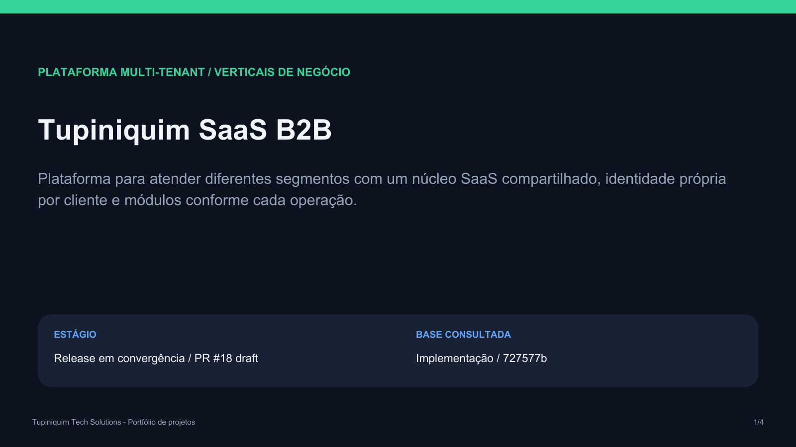
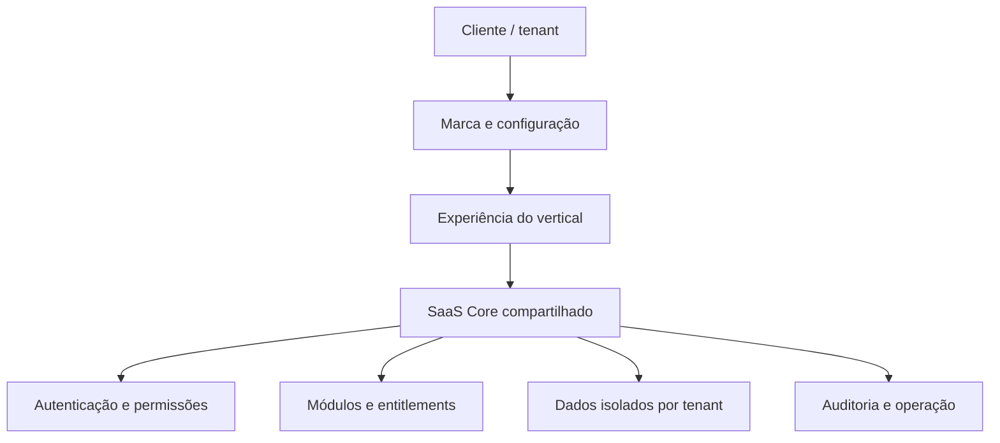

  

# Tupiniquim SaaS B2B

**Uma base SaaS compartilhada, com identidade própria e módulos por negócio.**

O **Sistema-SaaS-Geral**, também documentado como **Tupiniquim Vertical SaaS**, consolida experiências digitais de diferentes segmentos em uma plataforma multi-tenant. Cada cliente recebe seu ambiente, marca e permissões, preservando a experiência visual do vertical de origem.

**[Abrir apresentação em PDF](docs/APRESENTACAO_PROJETO.pdf)** · [Implementação do release](https://github.com/tupiniquimtechsolution-blip/Sistema-SaaS-Geral/tree/727577bf0c8ebad99284c2c9dd98b74b8efb0298) · [Checklist do release](https://github.com/tupiniquimtechsolution-blip/Sistema-SaaS-Geral/blob/727577bf0c8ebad99284c2c9dd98b74b8efb0298/docs/RELEASE_GREEN_DOD.md)

## Proposta de produto

**Novo cliente = novo tenant.** O núcleo compartilhado permite configurar marca, conteúdo e módulos por cliente, sem criar uma cópia independente do código para cada contratação.

| Necessidade do negócio | Resposta da plataforma |
| --- | --- |
| Manter uma marca própria | Configuração de logo, paleta, tipografia, conteúdo e mídias. |
| Atender operações diferentes | Experiências por vertical e módulos definidos pelo segmento. |
| Controlar acesso e contratação | Autenticação, permissões e entitlements por tenant. |
| Separar os dados dos clientes | Isolamento no servidor, com RLS como autoridade de acesso. |
| Editar com controle | Builder com preview privado e fluxo de revisões no candidato de release. |

## Estado atual

**Release em convergência, com gates pendentes.** A implementação está nas branches de desenvolvimento. A `main` apresenta o projeto e seus materiais, mas ainda não incorpora o código do candidato de release.

| Linha de trabalho | Situação consultada em 30/09/2026 |
| --- | --- |
| [PR #2 — fundação do monorepo](https://github.com/tupiniquimtechsolution-blip/Sistema-SaaS-Geral/pull/2) | Draft, com destino à main. |
| [PR #18 — convergência do release](https://github.com/tupiniquimtechsolution-blip/Sistema-SaaS-Geral/pull/18) | Draft, revisão consultada `727577b`. |
| [PR #19 — interface administrativa](https://github.com/tupiniquimtechsolution-blip/Sistema-SaaS-Geral/pull/19) | Draft, evolução visual em uma linha própria. |

O [checklist do release](https://github.com/tupiniquimtechsolution-blip/Sistema-SaaS-Geral/blob/727577bf0c8ebad99284c2c9dd98b74b8efb0298/docs/RELEASE_GREEN_DOD.md) registra entregas como onboarding atômico, Builder, importação do Templo e gateway de IA limitado a propostas. Ainda exige validação completa de billing, verificações em ambiente publicado, domínios/TLS, isolamento pela interface e rollback. O projeto não é apresentado aqui como aprovado para produção.

## Verticais e escopo

Os itens abaixo descrevem domínios e experiências do portfólio. A disponibilidade de cada fluxo depende da integração e dos gates do vertical.

| Vertical | Foco da experiência | Referência no release |
| --- | --- | --- |
| Padaria | Catálogo, pedidos e jornadas de compra | `apps/bakery` |
| Pet shop | Serviços, pets e relacionamento com tutores | `apps/pet` |
| Restaurante | Cardápio, reservas e pedidos | `apps/restaurant` |
| Máquinas pesadas | Showroom, equipamentos e contatos comerciais | `apps/heavy-machinery` |
| MetalArt | Serviços, portfólio e geração de contatos | `apps/metalart` |
| Templo / casa religiosa | Conteúdo público, agenda e serviços | Importação registrada, smoke remoto pendente. |
| Salão | Atendimento e serviços de beleza | Gates específicos ainda pendentes no checklist. |
| Painéis de LED | Vertical originalmente previsto | Retirado do escopo do release atual. |

## Arquitetura de produto

Os verticais preservam layouts e jornadas de origem. O núcleo compartilhado concentra contratos de tenancy, identidade e acesso. O Builder e o AI Tenant Studio atuam dentro das permissões do tenant. A IA não concede autorização.

| Camada | Base documentada |
| --- | --- |
| Interfaces | React e TypeScript |
| Dados e autenticação | Supabase Auth e Postgres |
| Isolamento e acesso | RLS, RBAC e entitlements |
| Publicação | Cloudflare como hosting canônico |
| Billing | Adapter Stripe no servidor, com ciclo completo ainda em validação |

## Qualidade e continuidade

O release exige evidências no mesmo commit para qualidade, segurança, builds, isolamento de tenants e operação publicada. Relatórios antigos registram etapas anteriores e não substituem o checklist de convergência vigente.

Para avaliar ou continuar o desenvolvimento, use a [revisão de implementação consultada](https://github.com/tupiniquimtechsolution-blip/Sistema-SaaS-Geral/tree/727577bf0c8ebad99284c2c9dd98b74b8efb0298) e leia seus contratos antes de executar comandos:

- [AGENTS.md](https://github.com/tupiniquimtechsolution-blip/Sistema-SaaS-Geral/blob/727577bf0c8ebad99284c2c9dd98b74b8efb0298/AGENTS.md)
- [Segurança](https://github.com/tupiniquimtechsolution-blip/Sistema-SaaS-Geral/blob/727577bf0c8ebad99284c2c9dd98b74b8efb0298/SECURITY.md)
- [Vertical Packs](https://github.com/tupiniquimtechsolution-blip/Sistema-SaaS-Geral/blob/727577bf0c8ebad99284c2c9dd98b74b8efb0298/docs/VERTICAL_PACKS.md)
- [Plano mestre](https://github.com/tupiniquimtechsolution-blip/Sistema-SaaS-Geral/blob/727577bf0c8ebad99284c2c9dd98b74b8efb0298/docs/PLANEJAMENTO_MESTRE_TUPINIQUIM_VERTICAL_SAAS.md)

## Apresentações

- [Tupiniquim SaaS B2B — apresentação do projeto](docs/APRESENTACAO_PROJETO.pdf)
- [Índice das apresentações dos verticais](https://github.com/tupiniquimtechsolution-blip/Sistema-SaaS-Geral/blob/727577bf0c8ebad99284c2c9dd98b74b8efb0298/docs/PRESENTATIONS_INDEX.md)

Consulta ao GitHub em **30/09/2026**. As referências de implementação usam a revisão fixa `727577b` para distinguir o material apresentado de mudanças posteriores.

**Tupiniquim Tech Solutions**
